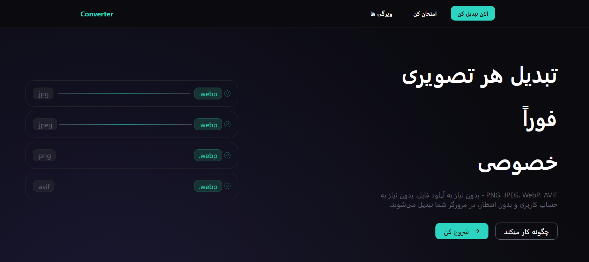
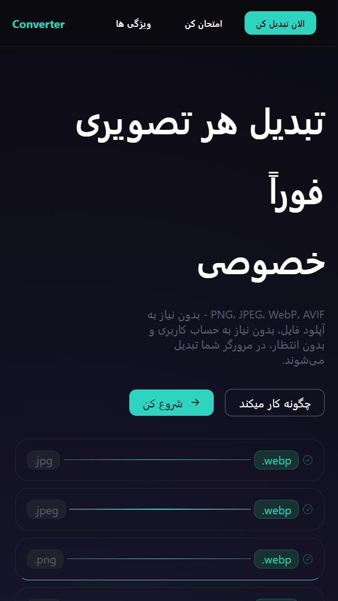

# WebP Image Converter

A simple, client‑side tool to convert images to WebP format — directly in your browser.

**Live Demo:** [View Website](https://hosseinnaseran.github.io/Converter)

---

## About

A lightweight browser-based tool that converts images to WebP format directly in your browser.

All processing happens locally — nothing is uploaded to any server.

WebP typically produces **smaller files** than JPEG or PNG, which helps improve page load times and reduce bandwidth usage.

---

## Features

- Works entirely in your browser — no server, no uploads  
- Instant conversion as soon as you select an image  
- One‑click download of the resulting WebP file  
- Dark theme with a clean, responsive layout  

---

## Tech Stack

- HTML5
- CSS3  
- JavaScript

---

## Preview

### Desktop



### Mobile




---

## Getting Started

Clone the repository and open the HTML file manually:

```bash
git clone https://github.com/HosseinNaseran/Converter.git
cd Converter
```

Then open `index.html` in any modern browser.

---

> **Note:** All image processing happens locally on your device. No images are uploaded or sent to any server.
## Usage

1. Click the upload button and choose an image.  
2. The WebP preview appears instantly.  
3. Click **Download** to save the `.webp` file.

---
## Author

**Hossein Naseran**

- [GitHub](https://github.com/HosseinNaseran)
- [LinkedIn](https://www.linkedin.com/in/hosseinnaseran)

---

⭐ If you found this project useful, consider giving it a star on GitHub.
